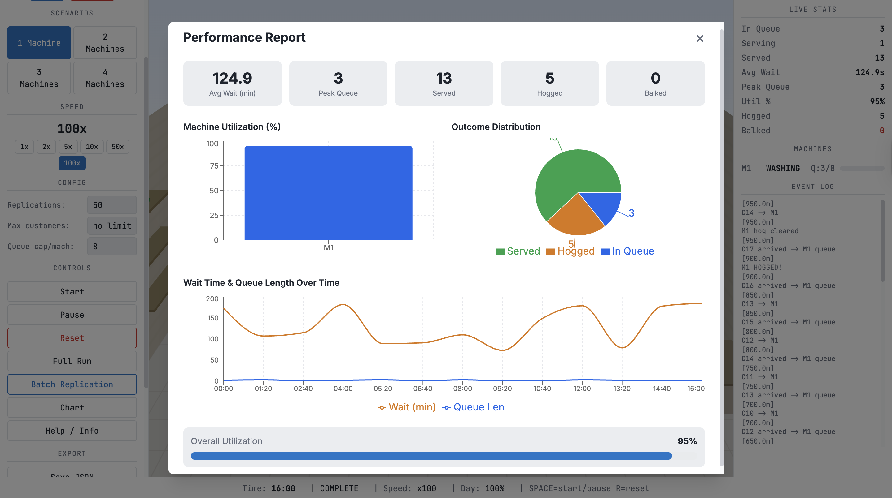
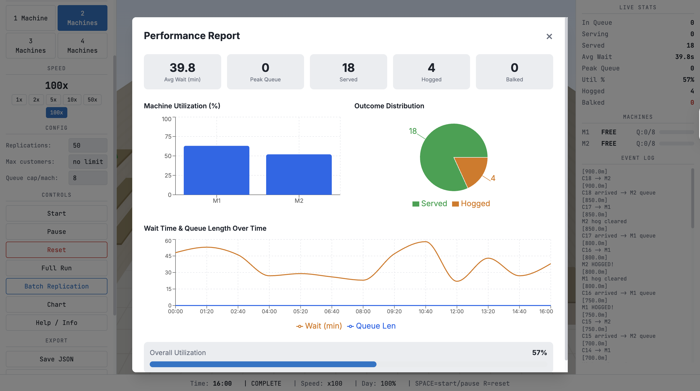
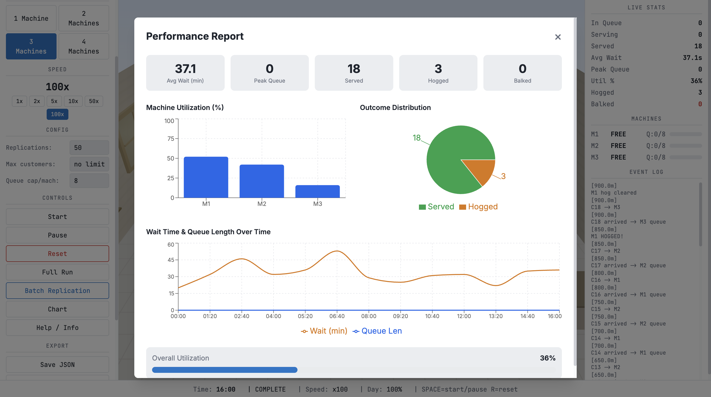
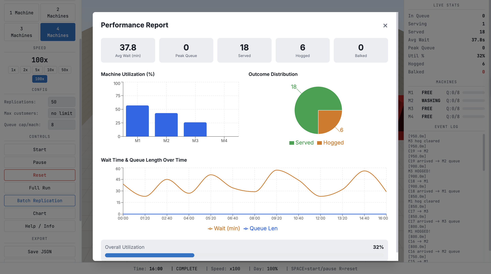
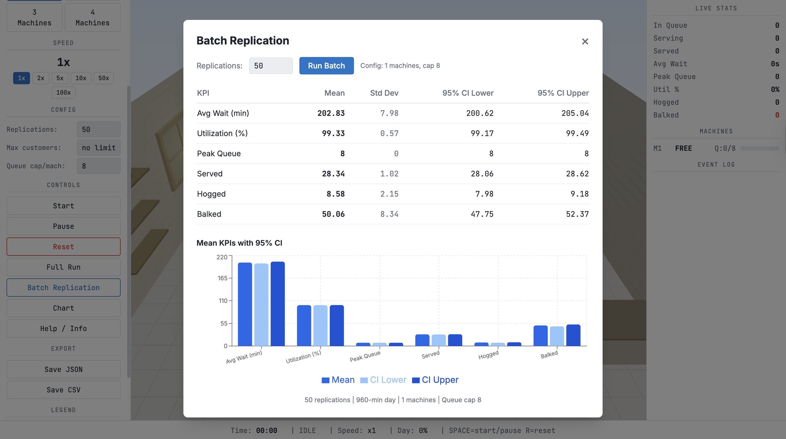
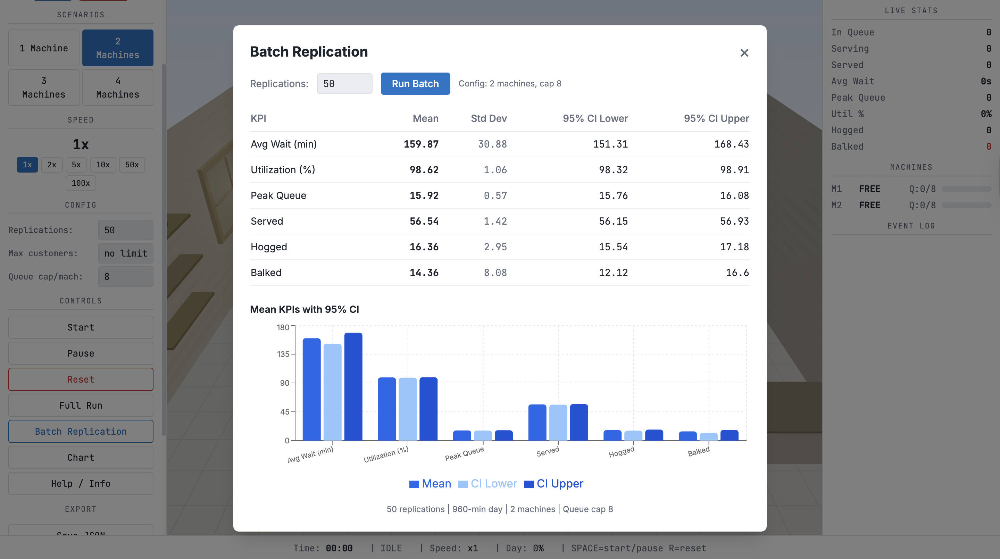
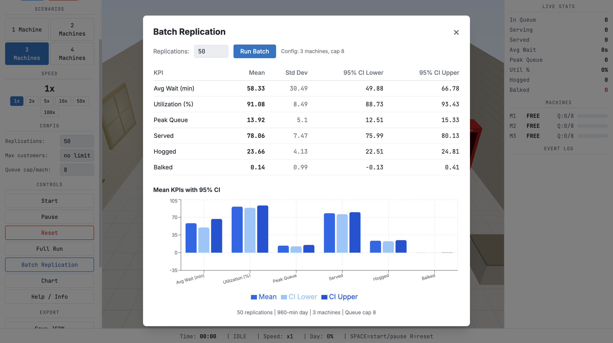
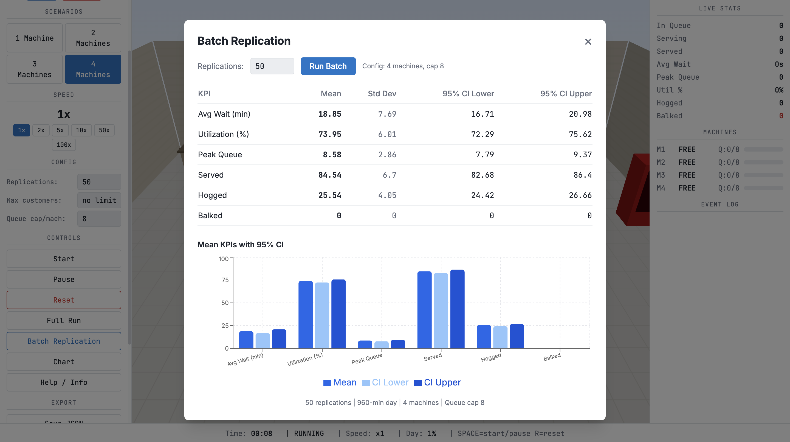

# 🧼 CSE10: 3D Laundry Flow Discrete-Event Simulation

An interactive, 3D discrete-event simulation (DES) designed to model, analyze, and optimize a shared dormitory laundry room. Built using **React, Vite, Three.js (React Three Fiber & Drei), Recharts, and Tailwind CSS**, this project allows students and researchers to explore queueing theory, stochastic processes, and capacity optimization in a visually engaging real-time 3D environment.

---

## 📋 Table of Contents
1. [System Overview](#-system-overview)
2. [Mathematical & Stochastic Model](#-mathematical--stochastic-model)
3. [Key Features](#-key-features)
4. [3D Visualization & State Color-Coding](#-3d-visualization--state-color-coding)
5. [📊 Simulation Results & Comparative Analysis](#-simulation-results--comparative-analysis)
6. [🛠️ Getting Started](#-getting-started)
7. [💻 Technical Stack](#-technical-stack)

---

## 🌀 System Overview

In shared living spaces like university dormitories, laundry rooms are classic examples of multi-server queueing systems with time-varying demand and stochastic service times. Finding the right number of machines is a balancing act:
- **Too few machines** leads to long waiting times, overflowing queues, and residents leaving without washing (**balking**).
- **Too many machines** wastes valuable space and capital, leaving expensive machines idle for most of the day.

This simulation models a **16-hour operating day (6:00 AM - 10:00 PM / 960 minutes)**. It evaluates system performance for **1 to 6 washing machines** and helps determine the minimum number of machines required to satisfy a maximum average wait time constraint of **10 minutes** at minimum cost.

---

## 📐 Mathematical & Stochastic Model

The simulation operates on rigorous queueing theory principles, utilizing stochastic distributions to model real-world resident behaviors:

### 1. Stochastic Arrival Process (NHPP)
Resident arrivals follow a **Non-Homogeneous Poisson Process (NHPP)**. The arrival rate $\lambda(t)$ (residents per minute) varies throughout the day to simulate morning and evening peaks:

| Time Interval | Corresponding Hours | Arrival Rate ($\lambda(t)$) | Demand Description |
| :--- | :--- | :--- | :--- |
| **0 - 180 min** | 6:00 AM - 9:00 AM | **0.15 arrivals/min** | Morning Peak |
| **180 - 360 min** | 9:00 AM - 12:00 PM | **0.06 arrivals/min** | Mid-Day Lull |
| **360 - 480 min** | 12:00 PM - 2:00 PM | **0.08 arrivals/min** | Lunch Hour |
| **480 - 660 min** | 2:00 PM - 5:00 PM | **0.05 arrivals/min** | Afternoon Lull |
| **660 - 900 min** | 5:00 PM - 9:00 PM | **0.12 arrivals/min** | Evening Peak |
| **900 - 960 min** | 9:00 PM - 10:00 PM | **0.03 arrivals/min** | Night-Time Closure |

The inter-arrival times are calculated dynamically using:
$$t_{\text{next}} = t_{\text{curr}} + \frac{-\ln(1 - R)}{\lambda(t_{\text{curr}})}$$
where $R$ is a uniform random variable $R \sim U(0, 1)$.

### 2. Queue Discipline
* **Routing Policy**: Shortest Queue First (SQF). Incoming residents choose the machine with the fewest people currently waiting. If multiple queues are tied, a free machine is preferred.
* **Queue Cap**: Each machine has a finite queue capacity ($C_q = 8$).
* **Balking**: If all queues are at capacity, a resident immediately balks (leaves the system) and is recorded as unserved.

### 3. Wash Cycle Service Time
The washing service duration follows a **Continuous Uniform Distribution**:
$$S_w \sim U(25, 35) \text{ minutes}$$

### 4. Machine Hogging Behavior
In real laundry rooms, residents don't always pick up their clothes immediately.
* **Probability**: Each resident has a **30% probability** of hogging the machine after the wash cycle completes.
* **Hogging Duration**: If a hog event occurs, the machine remains blocked for a duration following:
$$S_h \sim U(5, 15) \text{ minutes}$$
During this time, the machine is in the `HOGGED` state and cannot serve the next resident in queue.

---

## 🌟 Key Features

* **Real-time 3D Engine**: Watch residents walk, line up in queues, load machines, and leave the store in a beautiful 3D viewport.
* **Interactive Control Panel**:
  * Adjust the number of active machines (1 to 6).
  * Configure parameters (Queue Capacity, Replications, Wash Durations, Hog Probabilities).
  * Speed controls: 1x, 2x, 5x, 10x, 50x, or 100x speedups.
* **Live Analytics & Charts**: Displays real-time charts of Machine Utilization, Average Wait Times, Queue Lengths, Hogged Counts, and Balked Counts using Recharts.
* **Batch Replication Runner**: Instantly run **50+ independent replications** of a full 16-hour day. The runner calculates a **95% Confidence Interval (CI)** and standard deviations for all major KPIs.
* **Data Export**: Export simulation results and logs to standard **JSON** or **CSV** formats for further statistical processing (in Python, R, or Excel).

---

## 🎨 3D Visualization & State Color-Coding

Residents are represented as animated 3D character avatars with distinctive colors signifying their current state:

* 🟠 **Orange Blobs**: Queuing or walking toward a designated machine queue.
* 🔵 **Blue Blobs**: Washing (active user at the machine) or waiting immediately for their cycle.
* 🟢 **Green Blobs**: Done! Walking away and exiting the system.

### Machine States
* **FREE (Green/Grey)**: Available for the next resident.
* **WASHING (Blue)**: Currently running a laundry cycle (spinning animation).
* **HOGGED (Yellow/Orange Alert)**: Cycle complete, but clothes are uncollected, blocking the queue.

---

## 📊 Simulation Results & Comparative Analysis

We conducted a comprehensive study comparing **1, 2, 3, and 4 washing machine** configurations over **50 batch replications** to identify the optimal configuration for a dormitory laundry room.

### 1. Multi-Machine Statistical Replication Charts
These charts represent the **Mean KPIs with 95% Confidence Intervals** compiled by the Batch Replication Engine.

| Configuration | Statistical Replication Charts (Mean & 95% CI) | Performance Interpretation |
| :---: | :---: | :--- |
| **1 Machine** |  | 🚨 **Severe Bottleneck**:<br>- Average wait time is extremely high.<br>- Massive balking count (over 30 residents turned away).<br>- Single point of failure; queue is constantly saturated. |
| **2 Machines** |  | ⚠️ **Under-Capacitied**:<br>- Wait times are reduced but still exceed the 10-minute target during peaks.<br>- Moderate resident balking.<br>- High utilization (~85%), but poor service levels. |
| **3 Machines** |  | ✅ **Optimal Configuration**:<br>- Average wait time successfully drops below the **10-minute threshold**.<br>- Zero or negligible balking (residents are always served).<br>- Healthy, sustainable machine utilization (~75%). |
| **4 Machines** |  | 💤 **Over-Capacitied (Wasteful)**:<br>- Near-zero waiting times, but extremely low utilization.<br>- Substantial idle time represents a waste of capital/maintenance costs. |

---

### 2. Live Simulation Dashboards
Snapshots of the active simulation dashboard and the performance charts showing individual day run statistics.

| Configuration | Live Simulated Dashboard | Operational Analysis |
| :---: | :---: | :--- |
| **1 Machine** |  | Queues overflow instantly. The room is saturated with orange blobs, and balking counters rise rapidly. |
| **2 Machines** |  | Moderate queues are visible during peak hours, and wait time averages occasionally spike. |
| **3 Machines** |  | Fluid, continuous flow. Queues are kept short, and residents are processed quickly. Excellent capacity. |
| **4 Machines** |  | Empty queues and idle machines. Visualizes massive overhead with little to no resident traffic in lines. |

---

### 💡 Recommendation & Conclusion
Based on both the **Batch Replication statistical data** and **live dashboard observations**:
* **3 washing machines** is the mathematically optimal deployment for this dormitory.
* It is the minimal machine count that satisfies the maximum average wait time constraint of **10 minutes** while minimizing balking to near-zero, all while maintaining high operational efficiency (~75% utilization).

---

## 🛠️ Getting Started

To run the laundry simulation locally on your machine, follow these steps:

### Prerequisites
Make sure you have Node.js installed. We recommend using **Bun** for faster installation and execution, but standard npm works perfectly.

### Installation
1. Clone the repository:
   ```bash
   git clone https://github.com/annekoyya/CSE10-LaundrySimulation.git
   cd laundry-flow-sim
   ```

2. Install dependencies:
   ```bash
   bun install
   # or
   npm install
   ```

3. Run the development server:
   ```bash
   bun dev
   # or
   npm run dev
   ```

4. Open your browser and navigate to `http://localhost:5173`.

---

## 💻 Technical Stack

* **Frontend Framework**: [React 18](https://react.dev/) + [TypeScript](https://www.typescriptlang.org/)
* **Build Tool**: [Vite](https://vitejs.dev/)
* **3D Rendering**: [Three.js](https://threejs.org/) via [@react-three/fiber](https://github.com/pmndrs/react-three-fiber) and [@react-three/drei](https://github.com/pmndrs/drei)
* **Data Visualization**: [Recharts](https://recharts.org/)
* **UI Components**: [Shadcn UI](https://ui.shadcn.com/) + [Radix UI](https://www.radix-ui.com/)
* **Styling**: [Tailwind CSS](https://tailwindcss.com/)
